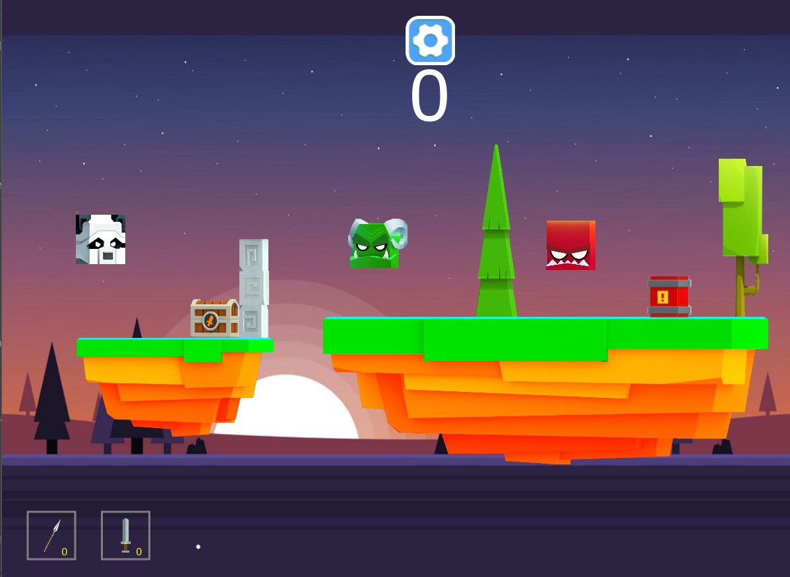
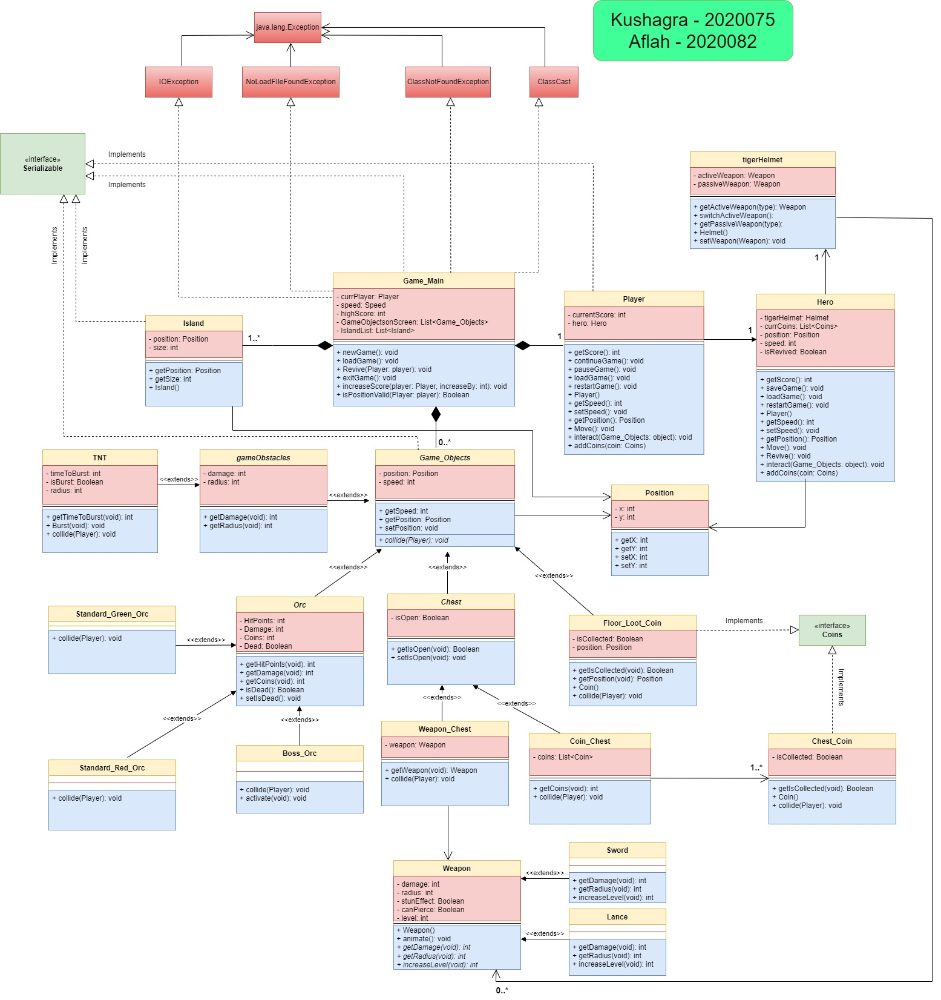
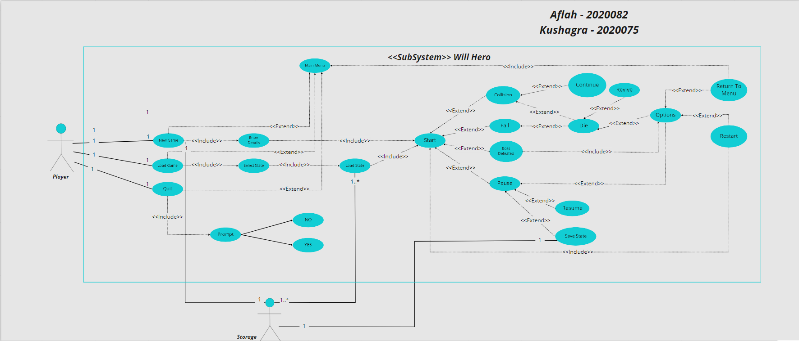

# The Will Hero Game

Adaptation of the popular game [Will Hero](https://apps.apple.com/us/app/will-hero/id1317231325) by [ZPlay](https://apps.apple.com/us/developer/zplay-beijing-info-tech-co-ltd/id531022725) for our [Advanced Programming Course (CSE201)](http://techtree.iiitd.edu.in/viewDescription/filename?=CSE201)

## Tech Stack

- Java
- JavaFX

## Visuals

Loading Screen -

Game Play - 

## Designs

UML Diagram -

Use Case Diagram - 

Creators:

[Kushagra](https://github.com/Kushagra20075) & [Aflah](https://github.com/aflah02)
