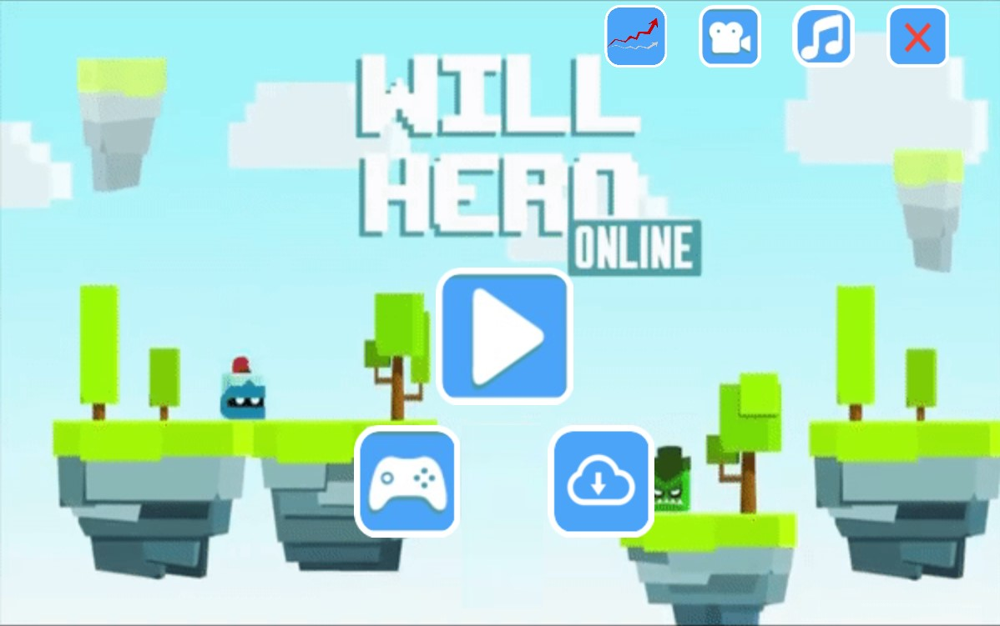

# The Will Hero Game

Adaptation of the popular game [Will Hero](https://apps.apple.com/us/app/will-hero/id1317231325) by [ZPlay](https://apps.apple.com/us/developer/zplay-beijing-info-tech-co-ltd/id531022725) for our [Advanced Programming Course (CSE201)](http://techtree.iiitd.edu.in/viewDescription/filename?=CSE201)

## Tech Stack

- Java
- JavaFX

## Salient Features

- Fully functional game with with lots of additional features
- Audio assets have been used to replicate the original game to the maximum
- Revive Functionality for the Hero on his First Death based on Coins
- 2 Kinds of Weapons for the Hero
- Choice between 4 different Hero Helmets
- Auto generated player statistics for recap
- Custom implemented video recording which captures this screen only for a specified duration
- Ghost feature which can be used to play against your previous game

## Visuals

Loading Screen -

Game Play - 

Helmet Choices - 

Player Statistics Menu - 

## Designs 

UML Diagram -

Use Case Diagram - 

Creators:

[Kushagra](https://github.com/Kushagra20075) & [Aflah](https://github.com/aflah02)
